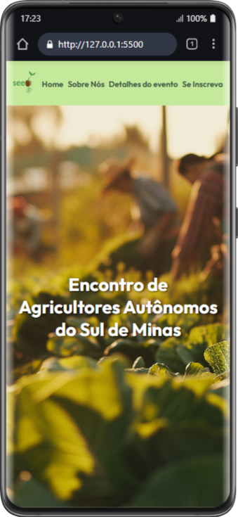

<h1>Landing Page Evento Agrícola - EAASM 🌱</h1>

<h2>Sobre o Projeto:</h2>
 

Este projeto é uma landing page desenvolvida como parte de um desafio prático personalizado criado pelo ChatGPT, com o objetivo de consolidar meus aprendizados em HTML puro.

Posteriormente, adicionei CSS para trabalhar também a parte visual. O design é original, feito por mim, mas o foco principal está no código e na estrutura semântica.

<h2>Objetivo:</h2>

Criar uma página HTML completa que simule a divulgação de um evento (palestra, feira, workshop ou festival), utilizando inicialmente apenas HTML, aplicando o máximo de conceitos aprendidos.

<h2>Requisitos do desafio:</h2>
<ul>
<li>Estrutura HTML completa</li>
<li>Cabeçalho com título e descrição</li>
<li>Seções de detalhes, atrações e programação</li>
<li>Tabela de atividades</li>
<li>Imagem e vídeo/mapa incorporado</li>
<li>Formulário de inscrição com campos obrigatórios</li>
<li>Links externos</li>
</ul>

<h2>Extras implementados:</h2>
<ul>
<li>Lista para regras/informações</li>
<li>Uso de <header>, <footer> e <nav> para treinar HTML semântico</li>
<li>Estilização com CSS próprio (após a versão inicial em HTML puro)</li>
</ul>

<h2> Preview:</h2>

<h2>Tecnologias utilizada:</h2>

<h2>Estrutura do projeto:</h2>
📁 landing-page-evento-agricola-EAASM  
├── index.html   # Estrutura HTML principal 
├── css/ 
    ├── style.css  # Estilos da página  
└── assets/      # Imagens e mídias utilizadas  

<h2>Aprendizados:</h2>
<ul>
<li>Prática de HTML semântico</li>
<li>Criação de layouts organizados usando apenas HTML</li>
<li>Estruturação de tabelas e formulários</li>
<li>Primeiros passos em design responsivo com CSS</li>
</ul>

<h2>Acesso</h2>

Você pode acessar o projeto aqui:

<a href="https://kamaudev.github.io/landing-page-evento-agricola-EAASM/" target="_blanck">Landing Page EAASM - GitHub Pages</a>